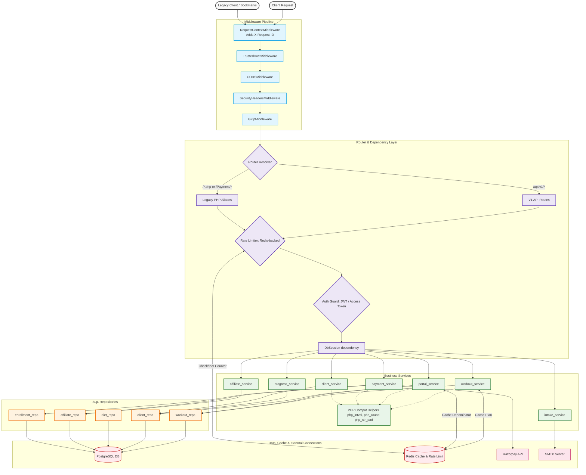
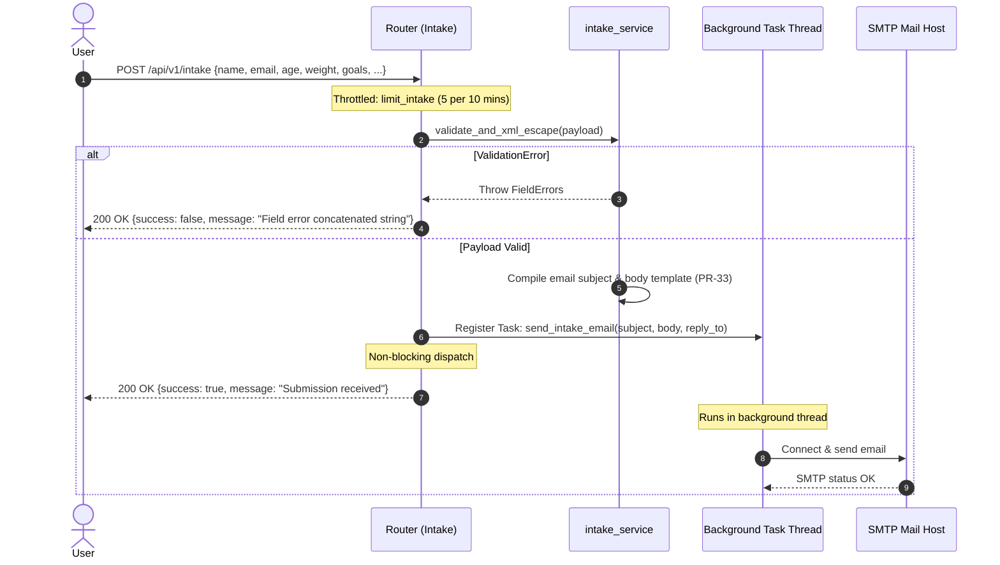

# GrindAI Backend API Workflow Diagrams

This document contains visual workflow diagrams mapping out the target architecture, API endpoints, request pipelines, and specific business workflows of the migrated **FastAPI backend (`backend-v1`)**.

---

## 1. Global Architecture & Layer Workflow

All requests follow a strict, decoupled layered flow:
`HTTP Request (Browser/SPA/Legacy client)` $\to$ `Middleware Layer` $\to$ `API Router (V1 or Legacy)` $\to$ `Auth & Rate Limiting Guards` $\to$ `Service Layer (Business Logic + PHP Compatibility Helpers)` $\to$ `Repository Layer (SQL queries)` $\to$ `Database / Redis / External APIs`.



---

## 2. Specific API Workflows

### 2.1 Workout Fetch with Redis Caching (`GET /api/v1/workout`)

Handles requests for workout plans. If cached, it returns immediately; otherwise, it hits the database, formats the payload according to legacy expectations, caches, and returns.

```mermaid
sequenceDiagram
    autonumber
    actor Client
    participant Router as API/Legacy Router
    participant Cache as Redis Cache
    participant Service as workout_service
    participant Repo as workout_repo
    participant DB as Postgres DB

    Client->>Router: GET /api/v1/workout?client_id=123 (or legacy alias)
    Note over Router: PR-01: Coerce client_id <br/> (Numeric: 123, Empty: 1, String/Invalid: 0)
    Router->>Cache: Check Cache for Key "workout_plan:123"
    alt Cache Hit
        Cache-->>Router: Return cached Plan JSON
        Router-->>Client: 200 OK (with plan & workout days)
    else Cache Miss
        Router->>Service: get_workout(db, client_id=123)
        Service->>Repo: find_active_plan_by_client_id(123)
        Repo->>DB: SELECT newest plan WHERE client_id=123 AND is_active=1
        DB-->>Repo: Plan record
        
        alt Plan Found
            Service->>Repo: find_plan_days_and_exercises(plan_id)
            Repo->>DB: SELECT days ordered by day_number; SELECT exercises by sort_order
            DB-->>Repo: Days & Exercises records
            Service->>Service: Construct Nested Response Envelope (PR-04)
        else No Plan Assigned
            Service->>Service: Return PR-03 Envelope: success=true, data=null, message="No workout plan assigned."
        end
        
        Service-->>Router: WorkoutResponse dict
        Router->>Cache: Save JSON to Cache (workout_plan:123, TTL=60s)
        Router-->>Client: 200 OK (Envelope Response)
    end
```

---

### 2.2 Payment Generation & Verification Flow

This covers the Razorpay purchase sequence (`POST /payments/order` to initiate, and `POST /payments/verify` to confirm).

```mermaid
sequenceDiagram
    autonumber
    actor User
    participant Router as Router (Payments)
    participant Service as payment_service
    participant Affiliate as affiliate_repo
    participant Razorpay as Razorpay API
    participant Enroll as enrollment_repo
    participant DB as Postgres DB

    == Step 1: Create Order ==
    User->>Router: POST /api/v1/payments/order {plan, price, coupon}
    Router->>Service: create_order(db, plan, price, coupon)
    
    alt Coupon present
        Service->>Affiliate: get_coupon(coupon)
        Affiliate->>DB: SELECT * WHERE code=coupon AND status='active' AND expiry_date >= CURDATE()
        DB-->>Affiliate: Coupon details
        alt Valid Coupon & Eligible Plan (PR-13)
            Service->>Service: Compute discounted price (PR-15)<br/>final_price = price - discount
        end
    end
    
    Note over Service: PR-16: Zero-price guard checks ORIGINAL price.<br/>Original <= 0 -> Fail with message.
    Service->>Razorpay: Create Order Request (amount: final_price * 100 paise)
    Razorpay-->>Service: Order ID & confirmation
    
    Service-->>Router: Return Order details (PR-18: rounded amount, unrounded final_price)
    Router-->>User: 200 OK {success: true, order_id, amount}

    == Step 2: Verify Payment & Enroll ==
    User->>Router: POST /api/v1/payments/verify {razorpay_order_id, razorpay_payment_id, razorpay_signature, ...}
    Router->>Service: verify_payment(db, payload)
    
    Note over Service: Target Hardening: Verify signature locally using HMAC-SHA256
    alt Signature Mismatch
        Service-->>Router: Throw SignatureValidationError
        Router-->>User: 400 Bad Request / 200 Bad Signature (depending on settings)
    else Signature Valid
        Service->>Enroll: create_enrollment(client_id, plan_id, status='Paid')
        Enroll->>DB: INSERT INTO enrollments ...
        DB-->>Enroll: Saved record
        Service-->>Router: Return success status
        Router-->>User: 200 OK {success: true, message: "Payment verified successfully"}
    end
```

---

### 2.3 Intake Form Submission (`POST /api/v1/intake`)

The intake form uses a background worker model, allowing immediate API response to the client while handling slow SMTP mailing asynchronously.



---

### 2.4 Transactional Admin Plan Import Workflow (`POST /admin/plans/import`)

This is the transactional import path (`PR-24` and `PR-25`) mapping version numbers, purging prior plans, and inserting nested Day/Exercise JSON inside a single database transaction.

```mermaid
flowchart TD
    classDef startEnd fill:#f5f5f5,stroke:#333,stroke-width:2px;
    classDef process fill:#e2f0d9,stroke:#385723,stroke-width:1px;
    classDef database fill:#fff2cc,stroke:#d6b656,stroke-width:1px;
    classDef decis fill:#fce4d6,stroke:#c65911,stroke-width:1px;
    classDef error fill:#f8cecc,stroke:#b85450,stroke-width:1px;

    Start([Admin issues Import Request]):::startEnd --> Auth{Authorized Admin Bearer?}:::decis
    Auth -->|No| Unauthorized[Return 401 / 403 HTTP Error]:::error
    Auth -->|Yes| DBTrans[Start Database Async Transaction]:::process
    DBTrans --> VersionLookup[Query MAX version_no for Client]:::database
    VersionLookup --> VersionCalc[Compute next_version = MAX + 1]:::process
    VersionCalc --> DeactivatePlans[Deactivate all existing plans for Client]:::database
    DeactivatePlans --> ParseJSON{Parse workout_json - is valid?}:::decis
    
    ParseJSON -->|No / Falsy PR-26| AbortTrans[Rollback Transaction]:::error
    AbortTrans --> ErrorMsg[Return JSON: success=false, message='Invalid JSON']:::error
    
    ParseJSON -->|Yes| InsertPlan[Insert Plan: is_active=1, version_no=next_version]:::database
    InsertPlan --> LoopDays[Loop through JSON days]:::process
    LoopDays --> InsertDay[Insert workout_day record: assign day_number]:::database
    InsertDay --> LoopEx[Loop through exercises under day]:::process
    LoopEx --> InsertEx[Insert workout_exercise: assign sort_order]:::database
    InsertEx --> NextEx{More Exercises?}:::decis
    NextEx -->|Yes| LoopEx
    NextEx -->|No| NextDay{More Days?}:::decis
    NextDay -->|Yes| LoopDays
    
    NextDay -->|No| CommitTrans[Commit Transaction]:::database
    CommitTrans --> InvalidateCache[Purge client workout cache & Global Denominator Cache]:::process
    InvalidateCache --> Success[Return JSON: success=true, message='Plan imported successfully']:::startEnd
    
    %% Error boundary handling
    InsertDay -- Error encountered --. AbortTrans
    InsertEx -- Error encountered --. AbortTrans
    InsertPlan -- Error encountered --. AbortTrans
```
